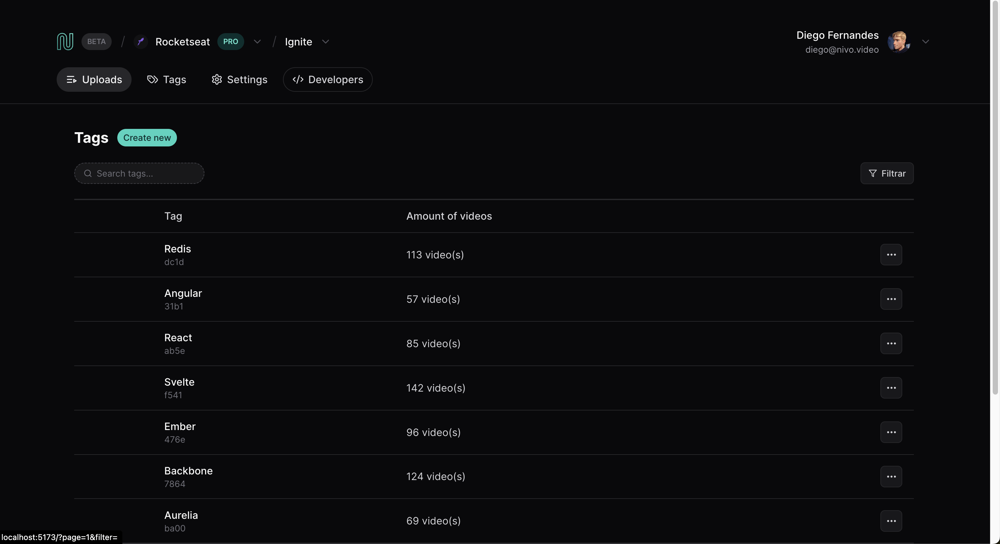

 

# Nivio

> Nivio | Uma plataforma de listagem de items

## 💻 Projeto 

O nivio foi feito com o intuito de praticar uma listagem de itens, dando um <b>poder</b> no resultado do usuário e utilizando as melhores práticas..

## 🔖 Layout

Você pode visualizar o layout do projeto através [desse link](https://www.figma.com/community/file/1341554349314625270). É necessário ter conta no [Figma](https://figma.com) para acessá-lo.

---

### 📄 O que foi usado:

- react
- typescript
- tailwind
- vitejs
- radix-ui
- useQuery

### 🛠 Mão na massa:

> Você pode realizar o clone deste repositório!

Clone o repositório:

`git clone https://github.com/Lucaslimasz/nivio-listing.git
`

### 💻 Executando o projeto 🚀

#### Na raiz do projeto, execute os comandos:

# Para instalar as dependências
yarn

# Para startar o projeto utilize
yarn dev || yarn server
